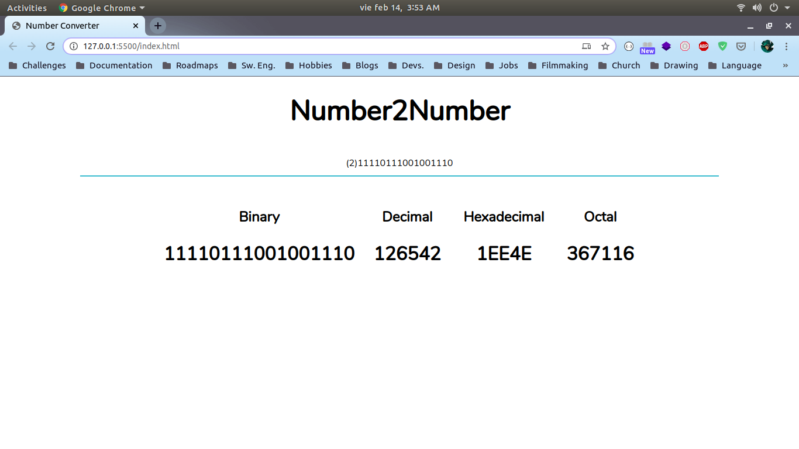

# **Number Converter**

## **Description**

Number Converter is a simple program that converts numbers in format binary to binary, octal, hexadecimal and decimal.

## **Features**

+ [x] Convert binary to decimal. The input value must have the format (2)######, where ##### represents the binary number.
+ [x] Convert binary to hexadecimal. The input value must have the format (2)######, where ##### represents the binary number.
+ [x] Convert binary to octal. The input value must have the format (2)######, where ##### represents the binary number.

## **Screenshots**

